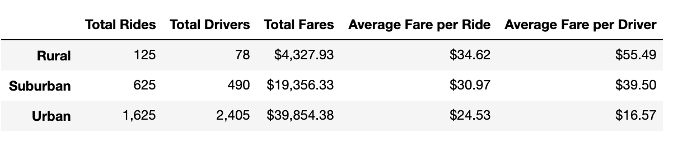
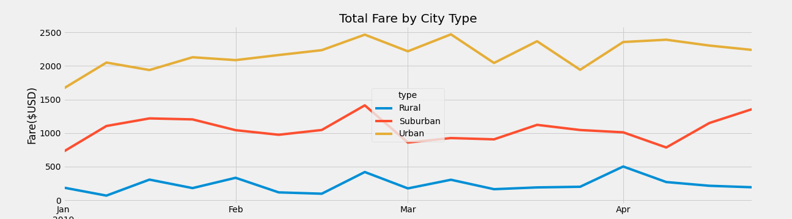

# PyBer_Analysis
Analysis on PyBer ride-sharing app data

## Overview of the analysis:
This analysis on PyBer ride-sharing data by city type using python3 in Jupyter notebook using pandas to create a summary dataframe.  Then using pandas and matplotlib, a multiple line graph is created for a subset of data from date range of 2019-01-01 through 2019-04-29, showing the total fares for each city type.

## Results: 
The PyBer ride-sharing summary provides insight into the data available to review the total rides, total drivers, total fares, average fare per ride and average fare per driver for each city type.  

- From this summary below, there is a lowest volume of rides in rural areas, next in suburban areas and highest ride volume in urban city areas. 

- The total drivers coincide with similar proportion of total rides for rural and suburban areas, whereas there are more drivers than total number of rides.  

- Although there is a lowest number of rides in rural areas, perhaps to cover the mileage in distance and with a smaller number of drivers, the average fare per driver is highest amongst the city types.

PyBer ride-sharing summary by City Type:

The multiple line graph is created for a subset of data from date range of 2019-01-01 through 2019-04-29, showing the total fares for each city type.

- From the multiple line graph below, you can clearly see the highest to lowest total fares by city types, urban being the highest, followed by suburban, then lowest fares in rural areas.  This matches the expected results in the ride-sharing summary for "Total Fares".  The difference remains steady throughout the sample months with slight patterns of increase and decrease in parallel amongst the city types.   

Total Fare by City Type:

## Summary: 
Based on the PyBer ride-sharing summary and multiple line graph of fares by city type, some recommendations:

(1) There is a larger proportion of total drivers to total rides for urban areas, causing the average fare per driver to be very low.  Comparing with other city types, this is the only city type that has more total drivers than rides.  Consider if there's a need for these additional drivers. Recommend to lower the number of total drivers in urban areas to increase avarege fare per driver.

(2) Reversely, for rural areas, there are only 78 drivers to cover larger distances for rides and may be interesting to review any data available on abandonment of riders with no matches with available drivers.  Recommend to increase number of total drivers in rural areas to cover the larger distance and possible ridership abandonment.

(3) The multiple line graph for the subset of data can show some patterns of increase or decrease in all city types.  Suggest to review data further for similar patterns to predict when during certain weeks of the year should increase or decrease the number of drivers to balance the increase or decrease of rides and fares.

